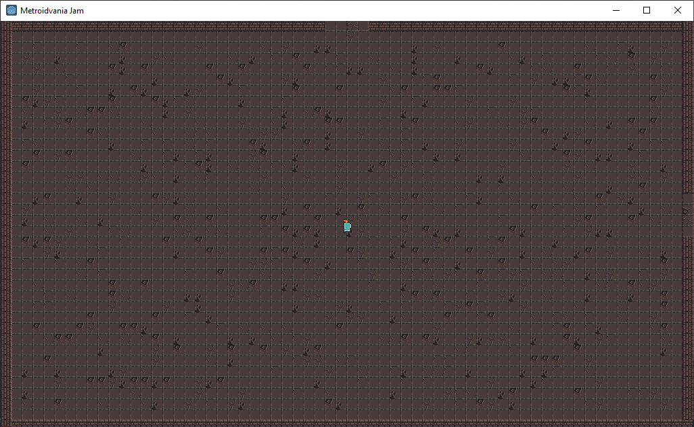

# Metroidvania Month 7 Jam

[Metroidvania Month 7 on Itch.io](https://itch.io/jam/metroidvania-month-7)

A metroidvania game developed in one month (Feb 15th - Mar 15th)

## About

## Gameplay

### Controls

## The Team

|Name|Position
|---|---
|DaVincino789 | Lead Developer
|Marx | Development
|Rinat Satybaldinov | Development
|Taurol | Development
|TheBoog | Design
|Senpai | Design
|Nicholassinger | Audio
|Nicke | Audio
|SoundsbyDane | Audio
|BricksParts | Art
|N. | Art
|Carinamachina | Project Manager

## The Tech

Created in [Godot Engine](https://godotengine.org/) 3.2

### Development Guidelines

Typed GD Script following [GDQuest](https://www.gdquest.com/docs/guidelines/best-practices/godot-gdscript/) best practices. Development should occur in a separate branch and should be tested by at least one other team member before merging into master / staging. Developers should create their own *personal* directory to work from then migrate their work into the main *game* directories.
